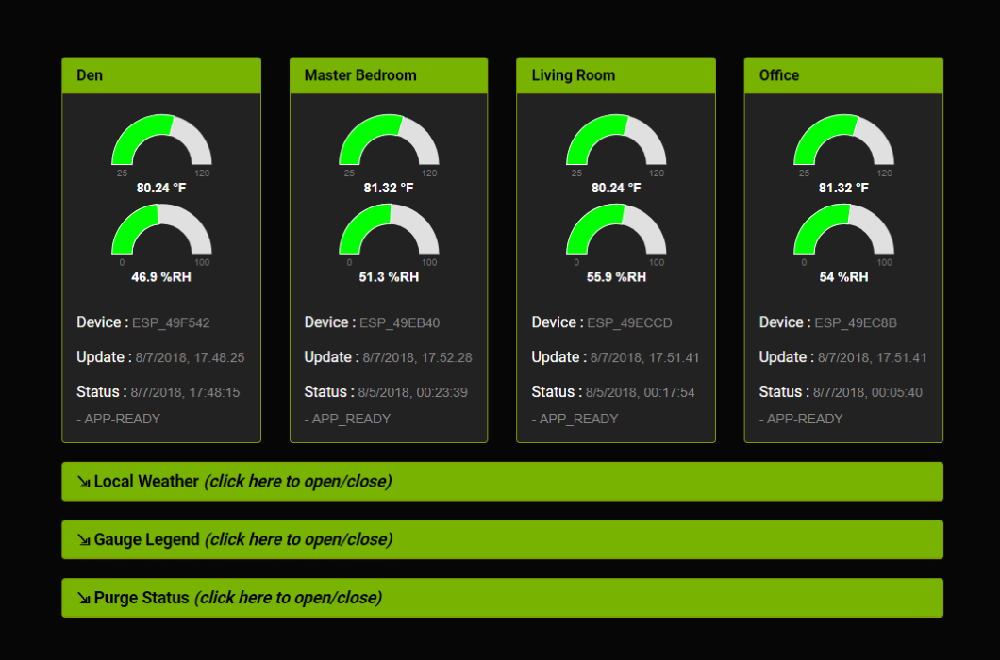
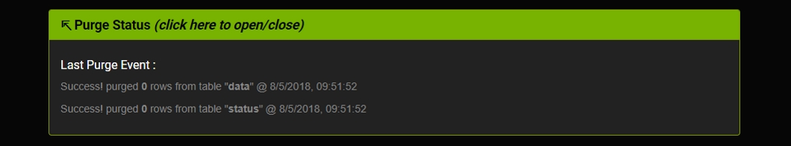
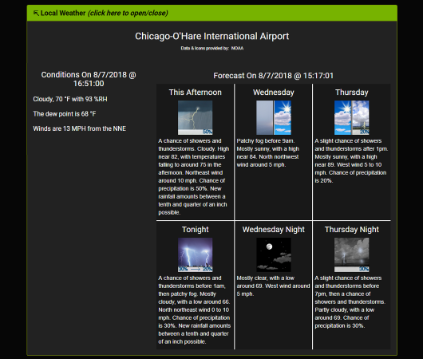

# NOTICE
**This repository is undergoing a major overhaul. Please do not use it at this time. 2018-08-05**

# client-dht-udp

This is a web client to my **[node-dht-udp](<https://github.com/jxmot/node-dht-udp>)** server, and displays temperature and humidity using gauges.

# History

This project was created as part of a larger project that I'll refer to as **_SensorNet_**. 

During the initial development I investigated a number of gauge type displays. My requirements for a gauge included - 

* Must be configurable. The gauge's range, segment coloring & size, overall size, and behavior need to be configurable. And if possible those settings should have the ability to be altered during run-time.
* Development must be current and active. "Old code" is not acceptable. 
* Must be free of *major* bugs or deficiencies. I expect the gauges to work, and not require my time to find and fix someone else's bugs.
* The integration must be straight forward and not cumbersome.
* Must be *responsive*. The gauge(s) must resize as necessary as the browser's viewport size is changed.

After investigating a number of options I decided that *<a href="https://c3js.org/" target="_blank">C3.js v0.4.18</a>*  would be the best choice. The others I tried were cumbersome and bug-ridden. In addition their documentation was also lacking. However I will continue to research additional options.

# Overview

The *complete* SensorNet system currently consists of - 

* Temperature & Humidity Sensors - Each sensor consists of a DHT22 device and an ESP-01S.
* Database Gateway - A NodeJS *server* that listens for sensor data and forwards the data to a database. In the current implementation the database used is *MySQL*. The server uses <a href="https://socket.io/" target="_blank">Socket.io</a> to "push" data updates to all connected web clients.
* Web Client - A browser based client that waits for status and data updates from the server and displays it to the user. It utilizes HTML/CSS, Bootstrap, JavaScript/JQuery, JSON, and Socket.io.

Here is a high level diagram of the SensorNet system :

<p align="center">
  
</p>

## Page Layout

<p align="center">
  
</p>

The page consists of four sensor *panels*, and three *collapsible panels*. It is responsive and viewable even on smaller mobile screens.

# Design Details

The SensorNet client function is to render sensor status and data for display on the browser. It does not interact with the SensorNet server except to establish a connection. After that it only receives sensor status and data.

The other components of the SensorNet system are here : 

* [esp8266-dht-udp](https://github.com/jxmot/esp8266-dht-udp) : Sensors
* [node-dht-udp](https://github.com/jxmot/node-dht-udp) : SensorNet Server

## Connecting to the SensorNet Server

Connecting to a Socket.io server is easy. The only *catch* is the client has to wait until all of the gauges have finished initializing. If it didn't wait status & data messages would be lost and not displayed. The gauge initialization code will emit a `gauges_ready` event after it has finished.

```javascript
$(document).on('gauges_ready', function() {
    // initialize sockets for incoming sensor status and data
    initSocket();
});

function initSocket()
{
    // connect to the server...
    socket = io.connect(socketserver.host+':'+socketserver.port+'/');

    // let us know when the server sees our connection and sends
    // us a confirmation...
    socket.on('server', function(data) {
        consolelog('server - '+JSON.stringify(data));
        // for future use, a placeholder for reacting
        // to messages from the server itself
        if(data.status === true) socketready = true;
        else socketready = false;
    });

    // listen for specific messages...
    socket.on('status', showStatus);
    socket.on('data', showData);
    socket.on('purge', showPurge);
    socket.on('wxobsv', showWXObsv);
    socket.on('wxfcst', showWXFcast);

    socket.on('disconnect', function(){ 
        socketready = false;
        consolelog('ERROR - socket is disconnected');
    });
};
```

### Configuration

The client must connect to a *known* Socket.io server. For convenience, the server's IP address and port number are configurable. An example can be found in `example_socketcfg.js`.

```json
var socketserver = {
    host: 'your-socketio-host',
    port: 3000,
};
```

Make a copy of the file and save it as `_socketcfg.js`. Then edit it to match your server and save it. 

## Status and Data Reception


```javascript
    // listen for specific messages...
    socket.on('status', showStatus);
    socket.on('data', showData);
    socket.on('purge', showPurge);
    socket.on('wxobsv', showWXObsv);
    socket.on('wxfcst', showWXFcast);
```

### Routing The Messages

## Status and Sensor Data Display

## Gauge Configuration

## System Status

At this time the only system status that the client will display is the *data purge status*. It is an indication of the number of old sensor status and data records that were deleted in a data purge. Please see [node-dht-udp](https://github.com/jxmot/node-dht-udp) for additional details.

<p align="center">
  
</p>


## Weather Data

The SensorNet client does not obtain the weather data from its source. That task belongs to the SensorNet server, along with storing it until requested by a web client. It will also periodically request new data from the weather data provider. And when new data has been collected the SensorNet server will broadcast the data to all connected clients.

<p align="center">
  
</p>

Please see [node-dht-udp](https://github.com/jxmot/node-dht-udp) for additional details.

<hr>
<br>
<p style="text-align:center">(c) 2018 Jim Motyl - https://github.com/jxmot/</p>
<br>
