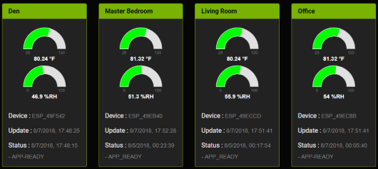
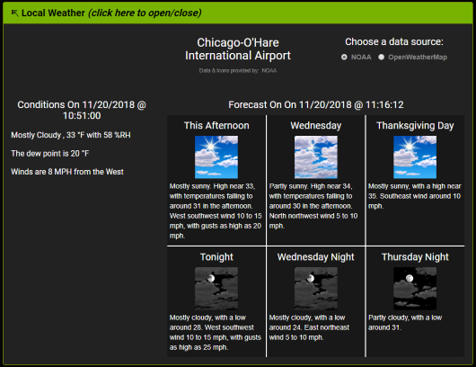
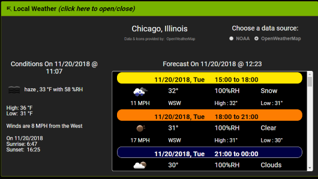
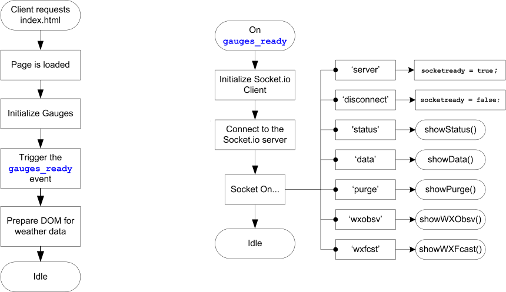
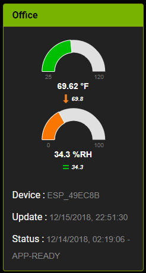
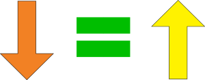
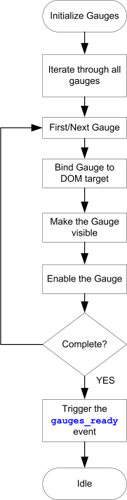
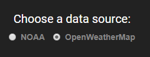

# client-dht-udp

This is a web client to my **[node-dht-udp](https://github.com/jxmot/node-dht-udp)** server, and displays temperature and humidity using gauges. It also displays current weather condition and forecast data from a *selectable* weather data source.

# Table of contents

- [History](#history)
- [Overview](#overview)
  - [Technologies Used](#technologies-used)
    - [Gauge Library](#gauge-library)
  - [Application UI Layout](#application-ui-layout)
    - [Sensor Data Display](#sensor-data-display)
    - [System Status](#system-status)
    - [Weather Data](#weather-data)
- [Design Details](#design-details)
  - [Application Start Up](#application-start-up)
  - [Gauges](#gauges)
    - [Configuration](#configuration)
    - [Gauge Configuration Components](#gauge-configuration-components)
    - [Panel and Gauge Initialization](#panel-and-gauge-initialization)
      - [Dynamic Creation](#dynamic-creation)
      - [Panel and Gauge HTML Elements](#panel-and-gauge-html-elements)
  - [Connecting to the SensorNet Server](#connecting-to-the-sensornet-server)
    - [Configuration](#configuration)
  - [Status and Data Reception](#status-and-data-reception)
  - [Weather Data Reception](#weather-data-reception)
    - [Service Selection](#service-selection)
      - [Switching Between Services](#switching-between-services)
- [Extras](#extras)
- [Future](#future)


# History

This project was created as a submodule of a larger project that I'll refer to as **_SensorNet_**. That project can be found here - **[sensornet](https://github.com/jxmot/sensornet)**.

During the initial development I investigated a number of gauge type displays. My requirements for a gauge included - 

* Must be configurable. The gauge's range, segment coloring & size, overall size, and behavior need to be configurable. And if possible those settings should have the ability to be altered during run-time.
* Development must be current and active. "Old code" is not acceptable. 
* Must be free of *major* bugs or deficiencies. I expect the gauges to work, and not require my time to find and fix someone else's bugs.
* The integration must be straight forward and not cumbersome.
* Must be *responsive*. The gauge(s) must resize as necessary as the browser's viewport size is changed.

After investigating a number of options I decided that *<a href="https://c3js.org/" target="_blank">C3.js v0.4.18</a>*  would be the best choice. The others I tried were cumbersome and bug-ridden. In addition their documentation was also lacking. However I will continue to research additional options.

# Overview

## Technologies Used

* HTML/CSS
* Bootstrap
* JavaScript/jQuery

### Gauge Library

*<a href="https://c3js.org/" target="_blank">C3.js v0.4.18</a>* was used in the creation of the gauges.

## Application UI Layout

<p align="center">
  
</p>

The page consists of four sensor *panels*, and three *collapsible panels*. It is responsive and viewable even on smaller mobile screens.

### Sensor Data Display

<p align="center">
  
</p>

### System Status

At this time the only system status that the client will display is the *data purge status*. It is an indication of the number of old sensor status and data records that were deleted in a data purge. Please see [node-dht-udp](https://github.com/jxmot/node-dht-udp) for additional details.

<p align="center">
  
</p>

### Weather Data

The SensorNet client does not obtain the weather data from its source. That task belongs to the SensorNet server, along with storing it until requested by a web client. The server will periodically request new data from the weather data provider. And when new data has been collected the SensorNet server will broadcast the data to all connected clients.

<p align="center">
  
</p>

<p align="center">
  
</p>

Please see [node-dht-udp](https://github.com/jxmot/node-dht-udp) for additional details.

# Design Details

The SensorNet client function is to render sensor status and data for display in a browser. It does not interact with the SensorNet server except to establish a connection and to request to change the weather data source. After that it only receives sensor status & data, and weather condition & forecast data.

## Application Start Up

<p align="center">
  
</p>

## Gauges

The gauges in this application are based on the C3.js gauge example found [here](https://c3js.org/samples/chart_gauge.html).

There have been many changes made to how the gauges are implemented. In this application each gauge is kept as an object in an array. The objects contain - 

* gauge application-specific configuration items
* gauge-instance specific appearance configuration items - type, range, color bands, caption, etc
* gauge-instance specific functions and event handlers

### Configuration

The gauges are grouped in pairs, one gauge for temperature and the other is humidity. And each gauge is represented as an object within an array. In HTML the pair of gauges reside in a *panel* along with sensor status messages.

Here's an example of a configuration for two gauges in the same panel : 

```javascript
var gauge_cfg = [
    {
        // Panel ID, title, and the data channel for sensor events
        panel: 'sensor-1',
        name: 'Den',
        data_channel: 'ESP_49F542',
        
        // Symbols are used to indicate current vs last reading direction of value
        trends: [Object.assign({}, trend), Object.assign({}, trend)],
        
        // The function that fills in static content and enables the event listener
        enable: _c3_enable,
        
        // The function that draws the gauge.
        draw: _c3_draw,
        
        // Temperature & Humidity Gauges
        gauges: [JSON.parse(JSON.stringify(gaugetemp)), JSON.parse(JSON.stringify(gaugehumi))]
    }
};
```

### Gauge Configuration Components

Each gauge configuration consists of the following components :

**Gauge Information :**

Here's where the panel and the sensor data channel are configured :

```javascript
panel: 'sensor-1',
name: 'Den',
data_channel: 'ESP_49F542'
```

* `panel` - The ID of the panel (*Bootstrap*) where the gauges will be contained.
* `name` - The content for the panel's header.
* `data_channel` - This links the gauges to a specific sensor. 

**Data Trend Indicator :**

*Trend indicators* show the direction the current reading has taken from the previous.

```javascript
trends: [Object.assign({}, trend), Object.assign({}, trend)],
```

After a second sensor reading has been received the trend indicators will appear - 

<p align="center">
  
</p>

The following symbols are used - 

<p align="center">
  
</p>

* Down Arrow - the current reading is lower than the last
* Equal - the current and last reading are equal
* Up Arrow - the current reading is higher than the last

**Gauge Functions :**

```javascript
enable: _c3_enable,
draw: _c3_draw,
```

* `enable` - Called for each gauge *pair*, fills in some static fields and starts an event listener waiting for sensor data and status events.
* `draw` - The function that draws the gauge.

**Gauge Definitions :**

```javascript
// Temperature & Humidity Gauges
gauges: [JSON.parse(JSON.stringify(gaugetemp)), JSON.parse(JSON.stringify(gaugehumi))]
```

* `gauges[0]` - Definition of a *C3.js* gauge configured as a temperature gauge.
* `gauges[1]` - Definition of a *C3.js* gauge configured as a humidity gauge.

The `JSON.parse(JSON.stringify())` part is absolutely necessary. It insure that a *deep copy* is made of the gauge definition(*object*) and that there are no references to the original.

Here's how the gauges are put together - 

```javascript
// the entire temperature gauge
var gaugetemp = {
    target: 'gauge_temp',
    unit: '°F',
    round: false,
    opt: _c3_opt_t,
    chart: {}
};
// the entire humidity gauge
var gaugehumi = {
    target: 'gauge_humi',
    unit: '%RH',
    round: false,
    opt: _c3_opt_h,
    chart: {}
};
```

* `target` - The element ID where the gauge will be drawn.
* `unit` - Contains `'°F'` or `'°C'` to indicate Fahrenheit or centigrade. And `'%RH'` for humidity.
* `round` - If true the gauge value will be rounded to the nearest integer value.
* `opt` - Gauge options that are *C3.js* specific. 
* `chart` - Used by the *C3.js* draw function.

**Deep Copy Issue :**

As noted above *deep copying* was used, however that method cannot copy *functions*. The work around used was to rewrite the functions that were lost via the deep copy of the `_c3_opt_t` and `_c3_opt_h` objects. This can be seen in [Dynamic Creation](#dynamic_creation).

### Panel and Gauge Initialization

<p align="center">
  
</p>

#### Dynamic Creation

```javascript
(function() {
    initGauges();
})();

function initGauges() {
    // initialize all gauges...
    for(var ix = 0; ix < gauge_cfg.length; ix++)
    {
        $('#sensornet #panel').eq(ix).append(makeSensorPanel(ix));

        // attach the gauges to their DOM target
        //      temperature
        gauge_cfg[ix].gauges[0].opt.bindto = $('#' + gauge_cfg[ix].panel + ' #' + gauge_cfg[ix].gauges[0].target)[0];
        // must put these back into the gauge because the deep 
        // copy used when it was configured can't copy functions
        gauge_cfg[ix].gauges[0].opt.data.selection.isselectable = function(d){return false;};
        gauge_cfg[ix].gauges[0].opt.gauge.label.format = function(value,ratio){return null;};
        // create the gauge
        gauge_cfg[ix].gauges[0].chart = c3.generate(gauge_cfg[ix].gauges[0].opt);

        //      humidity
        gauge_cfg[ix].gauges[1].opt.bindto = $('#' + gauge_cfg[ix].panel + ' #' + gauge_cfg[ix].gauges[1].target)[0];
        gauge_cfg[ix].gauges[1].opt.data.selection.isselectable = function(d){return false;};
        gauge_cfg[ix].gauges[1].opt.gauge.label.format = function(value,ratio){return null;};
        gauge_cfg[ix].gauges[1].chart = c3.generate(gauge_cfg[ix].gauges[1].opt);

        // enable the gauge-pair for sensor data & status events
        gauge_cfg[ix].enable();
    }
    // let the app know we're ready for incoming sensor 
    // status and data
    $(document).trigger('gauges_ready', true);
};
```

#### Panel and Gauge HTML Elements

The gauge panels(*Bootstrap*) are *dynamically* created when the page loads. The number of panels is determined by the number of configured gauge panels in `gauge_cfg[]`.

Here's a sample of a panel's HTML : 

```html
<!-- sensor panel, 2 gauges -->
<div id="sensor-1" class="panel panel-success">
    <div class="panel-heading">
        <h3 class="panel-title sensor-panel-title">Den</h3>
    </div>
    <div class="panel-body">
        <div class="row">
            <div class="col-lg-12 col-md-12 col-sm-6 col-xs-6 gauge_outer">
                <div id="gauge_temp" class="gauge_inner"></div>
                <div id="gaugelabel" class="gauge_label"></div>
            </div>
            <div class="col-lg-12 col-md-12 col-sm-6 col-xs-6 gauge_outer">
                <div id="gauge_humi" class="gauge_inner"></div>
                <div id="gaugelabel" class="gauge_label"></div>
            </div>
        </div>
        <br>
        <header><h6>Device :</h6> <span id="gaugeinfo">ESP_49F542</span></header>
        <header><h6>Update :</h6> <span id="gaugeinfo"></span></header>
        <header><h6>Status :</h6> <span id="gaugeinfo"></span></header>
    </div>
</div>
<!-- ^sensor panel, 2 gauges -->
```

## Connecting to the SensorNet Server

Connecting to a Socket.io server is easy. The only *catch* is the client has to wait until all of the gauges have finished initializing. If it didn't wait status & data messages would be lost and not displayed. The gauge initialization code will emit a `gauges_ready` event after it has finished.

```javascript
$(document).on('gauges_ready', function() {
    // initialize sockets for incoming sensor status and data
    initSocket();
});


var socket;
var socketready = false;

function initSocket() {
    socket = io.connect(socketserver.host+':'+socketserver.port+'/', {
                        'reconnection': true,
                        'reconnectionDelay': 3000,
                        'reconnectionDelayMax' : 5000,
                        'reconnectionAttempts': 4});

    socket.on('connect_error', function(error) {
        // it's convenient that the alert halts everything,
        // makes it easier when restarting the server.
        alert('connect_error - '+JSON.stringify(error));
    });

    socket.on('server', function(data) {
        console.log('server - '+JSON.stringify(data));
        if(data.status === true) socketready = true;
        else socketready = false;
    });

    socket.on('status', showStatus);
    socket.on('data', showData);
    socket.on('purge', showPurge);
    socket.on('wxobsv', showWXObsv);
    socket.on('wxfcst', showWXFcast);

    socket.on('disconnect', function(){ 
        socketready = false;
        consolelog('ERROR - socket is disconnected');
    });
};
```

**NOTE : The SensorNet server must be running and accessible over the network by the client.**

### Configuration

The client must connect to a *known* Socket.io server. For convenience, the server's IP address and port number are configurable. An example can be found in `example_socketcfg.js`.

```
var socketserver = {
    host: 'your-socketio-host',
    port: 3000,
};
```

Make a copy of the file and save it as `_socketcfg.js`. Then edit it to match your server and save it. 

## Status and Data Reception

```javascript
    // listen for specific messages...
    socket.on('status', showStatus);
    socket.on('data', showData);
    socket.on('purge', showPurge);
    socket.on('wxobsv', showWXObsv);
    socket.on('wxfcst', showWXFcast);
```

## Weather Data Reception

The SensorNet server is responsible for collecting and distributing the weather data to all connected clients. This approach is well suited for reducing the quantity of API requests that are sent to the weather data provider. Please see **[node-dht-udp](https://github.com/jxmot/node-dht-udp)** for detailed information.

### Service Selection

In the upper-right corner of the weather data panel are some radio buttons. They're used for selecting a weather data service as the provider for the displayed data and icons.

<p align="center">
  
</p>

#### Switching Between Services

The radio buttons have `data` attributes that contain a *weather service ID* that is sent to the server to select a data provider. 

```html
<div id="wxsvc-picker" class="wxsvc-center">
    <h5>Choose a data source:</h5>
    <div class="radio-inline">
        <label class="use-pointer"><input class="use-pointer" type="radio" data-wxsvc="noaa-v3" name="optradio">NOAA</label>
    </div>
    <div class="radio-inline">
        <label class="use-pointer"><input class="use-pointer" type="radio" data-wxsvc="owm-v25" name="optradio" checked>OpenWeatherMap</label>
    </div>
</div>
```

```javascript
let wxsvc_selection = '';

(function() {
    wxsvc_selection = $('#wxsvc-picker input[type=radio]:checked').data('wxsvc');
    $(document).trigger('wxsvc_select', [wxsvc_selection]);
};

$('#wxsvc-picker input[type=radio]').on('change', function() {
    wxsvc_selection = $(this).data('wxsvc');
    $(document).trigger('wxsvc_select', [wxsvc_selection]);
});
```

# Extras

* `consolelog.js` - `consolelog()`, an alternative to `console.log()` but where a boolean variable determines if output is sent to the console.
* `utils.js` - `adaptColor()`, used for automatically adjusting the text color based on the background color of a specified element. 

# Future

Here's a list of things I'd like to investigate and possibly implement : 

* Increase quantity of gauge panels. And place all of them into a carousel or some other type of container. It would have to work for mobile and desktop browsers.
* Receive gauge info from the server via Socket.io during application start-up. This would include - 
    * Name
    * Data Channel
    * *TBD*
* Gauge visual enhancements : 
    * Increase the number of value ranges for both types of gauge.
* Add a panel to show current thermostat state. *This will require modifications to the server*
* Historical sensor data graphs.
* Historical weather data, saved on the server and recalled by the application. 

<br>
<hr>
<br>
<p style="text-align:center">(c) 2018 Jim Motyl - https://github.com/jxmot/</p>
<br>
