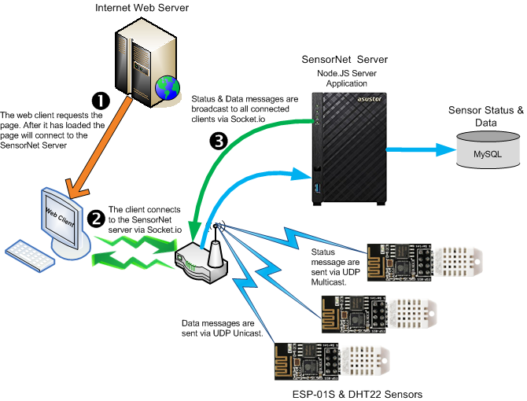

# client-dht-udp

This is a web client to my **[node-dht-udp](<https://github.com/jxmot/node-dht-udp>)** server, and displays temperature and humidity using gauges.

# History

This project was created as part of a larger project that I'll refer to as **_SensorNet_**. 

During the initial development I investigated a number of gauge type displays. My requirements for a gauge included - 

* Must be configurable. The gauge's range, segment coloring & size, overall size, and behavior need to be configurable. And if possible those settings should have the ability to be altered during run-time.
* Development must be current and active. "Old code" is not acceptable. 
* Must be free of *major* bugs or deficiencies. I expect the gauges to work, and not require my time to find and fix someone else's bugs.
* The integration must be straight forward and not cumbersome.
* Must be *responsive*. The gauge(s) must resize as necessary as the browser's viewport size is changed.

After investigating a number of options I decided that *<a href="https://c3js.org/" target="_blank">C3.js v0.4.18</a>*  would be the best choice. The others I tried were cumbersome and bug-ridden. In addition their documentation was also lacking. However I will continue to research additional options.

# Overview

  

The *complete* SensorNet system currently consists of - 

* Temperature & Humidity Sensors - Each sensor consists of a DHT22 device and an ESP-01S.
* Database Gateway - A NodeJS *server* that listens for sensor data and forwards the data to a database. In the current implementation the database used is *MySQL*. The server uses <a href="https://socket.io/" target="_blank">Socket.io</a> to "push" data updates to all connected web clients.
* Web Client - A browser based client that waits for status and data updates from the server and displays it to the user. It utilizes HTML/CSS, Bootstrap, JavaScript/JQuery, JSON, and Socket.io.

Here is a high level diagram of the SensorNet system :

  

# Design Details

## Connecting to the SensorNet Server

## Sensor Status and Data Reception

## Status and Sensor Data Display

## Gauge Configuration

## Weather Data

