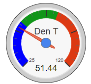

# NOTICE
**This repository is undergoing a major overhaul. Please do not use it at this time. 2018-08-05**

# client-dht-udp

This is a web client to my **[node-dht-udp](<https://github.com/jxmot/node-dht-udp>)** server, and displays temperature and humidity using gauges.

## History

This project was created as part of a larger project that I'll refer to as **_SensorNet_**. The first pass will provide a means to display temperature and humidity for one or more *sensors*. 

During the initial development I investigated a number of gauge type displays. My requirements for a gauge included - 

* Must be configurable. The gauge's range, segment coloring & size, overall size, and behavior need to be configurable. And if possible those settings should have the ability to be altered during run-time.
* Development must be current and active. "Old code" is not acceptable. 
* Must be free of *major* bugs or deficiencies. I expect the gauges to work, and not require my time to find and fix someone else's bugs.
* The integration must be straight forward and not cumbersome.
* Must be *responsive*. The gauge(s) must resize as necessary as the browser's viewport size is changed.

After investigating a number of options I decided that *Google Gauges* would be the best choice *at this time*. The other I tried were cumbersome and bug-ridden. In addition their documentation was also lacking. However I will continue to research other options.

The only requirement that isn't met with *Google Gauges* is responsiveness. However I believe that I can implement a method to achieve this.

## Overview

The *complete* SensorNet consists of - 

* Temperature & Humidity Sensors - Each sensor consists of a DHT22 device and an ESP-01S.
* Database Gateway - A NodeJS *server* that listens for sensor data and forwards the data to a database. In the current implementation the database used is *Firebase*.
* Web Client - A browser based client that monitors the database for new data and displays it to the user.

<p align="center">
  
</p>

## Design Details

From this point on it is *assumed* that the reader has some experience with - 

* HTML & CSS - just the basics.
* JavaScript - specifically events, triggers, and handlers. And accessing the DOM.
* Firebase - data retrieval.

The following topics will be covered in this document - 

* Gauge configuration & initialization.
* Data events.

### Gauge Configuration

The displayed gauges are configured in an array of objects found in `assets/js/gauge-cfg.js`. The following aspects are configurable - 

* Target HTML element - typically a `<div>` with an ID. The element's ID is considered to be the *target*.
* Gauge Name/Label - A string that is shown on the gauge face.
* Gauge Type - In this application the type can be either "**T**" (*temperature*) or "**H**" (*humidity*).
* Gauge Unit - This can be either "**F**" (*Fahrenheit*) or "**%**" (*percent*). Please note that the display of  this setting will be implemented in a future version of this application.
* Data Source - Typically this will be "**firebase**", however the code can also accept "**thingspeak**" if the data is routed through **[ThingSpeak](<https://thingspeak.com/>)**.
* Data Channel - Each of the sensors (*ESP8266 devices*) have unique hostnames. For example - **ESP_49F542** where the last 6 characters represent the 3 right-most octets of the devices' *MAC address*. This will be passed in the data as `dev_id` (*device ID*).
* Rounding of data values - This `bool` if set to `true` will enable rounding to an integer value. And the gauge will not display any fractional values.
* Google Gauge Options - This is where the appearance of the gauge is configured. The *range*, width & height, segment colors & ranges, and presence of *ticks* are configured here. See **[Google Charts Visualization: Gauge](<https://developers.google.com/chart/interactive/docs/gallery/gauge>)** for detailed information.

In addition to gauge configuration settings each gauge in the array also contains a `chart` and `data` object that are representations of the Google Gauge. There is also a function within each gauge object in the array. This function aids in the handling of an event that is triggered for each gauge when new data arrives. The `eventType` is the `data_channel`. And allows for better distribution of incoming data to a specified gauge.

Here is an example of a gauge configuration - 

```javascript
    {
        target: 'gauge_div3',
        name:'Den',
        type: 'T',
        unit: 'F',
        data_source: 'firebase',
        data_channel: 'ESP_49F542',
        round: false,
        opt: {
            min: 25, max: 120, 
            width: 180, height: 180,
            yellowColor: 'blue',
            yellowFrom:25, yellowTo: 55,
            greenFrom: 55, greenTo: 80,
            redFrom: 80, redTo: 120,
            minorTicks: 5
        },
        chart: {},
        data: {},
        enable: _enable
    }
```

This is the function used in each of the gauge objects - 

```javascript
var _enable = function() {
    var _data = this.data;
    var _chart = this.chart;
    var _type = this.type;
    var _name = this.name;
    var _opt = this.opt;
    // NOTE: data_channel is known as "dev_id" in the data
    $(document).on(this.data_channel, function(e, sdata) {
        console.log(_name + '  ' + _type);
        console.log('got data - ' + JSON.stringify(sdata));

        var point = 0;
        if(_type === 'T') {
            point = sdata.t;
        } else point = sdata.h;
        _data.setValue(0, 1, point);
        _chart.draw(_data, _opt);
    });
};
```

The preceding gauge configuration will display like this - 

<p align="center">
  
</p>

Each function instance requires access to members within its associated *gauge object*. This is accomplished with this portion of the code -

```javascript
    var _data = this.data;
    var _chart = this.chart;
    var _type = this.type;
    var _name = this.name;
    var _opt = this.opt;
```

Please note that the gauge *options* can be changed during run-time and the gauge's appearance will update on the subsequent data update - `_chart.draw(_data, _opt);`. 

#### Gauge Initialization

Each gauge in the array is initialized in sequence. This is done when `initGauges()` is called from within `assets/js/ggauges.js` when the gauge is loaded.

```javascript
// load the google gauge visualization - google API load 
google.load('visualization', '1', {packages:['gauge']});
google.setOnLoadCallback(initGauges);

// initialize the guages...
function initGauges() {
    // initialize all gauges...
    for(var ix = 0; ix < gauge_cfg.length; ix++)
    {
        gauge_cfg[ix].data = new google.visualization.DataTable();
        gauge_cfg[ix].data.addColumn('string', 'Label');
        gauge_cfg[ix].data.addColumn('number', 'Value');
        gauge_cfg[ix].data.addRows(1);
        // attach the gauge to its DOM target
        gauge_cfg[ix].chart = new google.visualization.Gauge(document.getElementById(gauge_cfg[ix].target));
        // set the gauge label, this will be the configured name plus its type
        gauge_cfg[ix].data.setValue(0, 0, gauge_cfg[ix].name + ' ' + gauge_cfg[ix].type);
        // choose the appropriate initialization based on the data source 
        // for the gauge
        if('thingspeak' === gauge_cfg[ix].data_source) {
            // This will start a repeating "read" of Thingspeak data, with an
            // interval that's configured in _thingspk-cfg.js
            thingspk_loadData(ix);
            setInterval(thingspk_loadData, thingspk_cfg.interval, ix);
        } else if('firebase' === gauge_cfg[ix].data_source) {
            // This gauge uses Firebase. Enable the gauge to receive updates from
            // the database as records are written to it.
            gauge_cfg[ix].enable();
            // The enable() function will read the last written record for only
            // the most recent sensor. This will insure that each gauge is updated
            // when it's created.
            firebase_initGauge(gauge_cfg[ix].data_channel);
        }
    }
};
```

### Data Events

*Data events* are triggered when a new record is added to the sensor data log. This is done by waiting for the `child_added` Firebase event. For example, in `assets/js/firebase.js` - 

```javascript
/*
    Wait for new data to be written to the sensor data log
*/
gSensorData.orderByChild('tstamp').limitToLast(1).on('child_added', newSensorData);

function newSensorData(snapShot) {
    var data = JSON.parse(JSON.stringify(snapShot.val()));
    $(document).trigger(data.dev_id, data);
};
```

#### Handling Incoming Data


## Additional Design Considerations

### Limiting Firebase Traffic

Please review the README in the **[node-dht-udp](<https://github.com/jxmot/node-dht-udp>)**  repository for important details.

## Future Development

### Responsive Google Gauges

By nature *Google Gauges* are **not** responsive. My plan is to use the JavaScript `onresize` event to accomplish this. My current gauge implementation writes the gauge options each time the data is updated. So it *should* be possible to alter the size of a guage on the fly as the window is resized. This would require that each gauge save its current data so that a resize will update the gauge without having to wait for a live data update.
